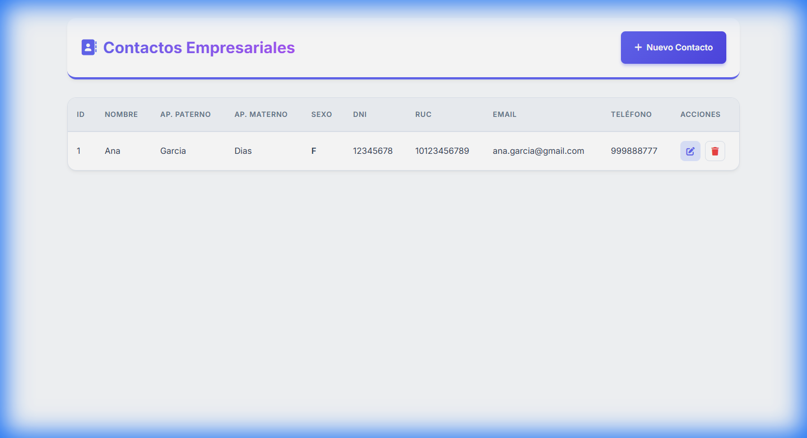
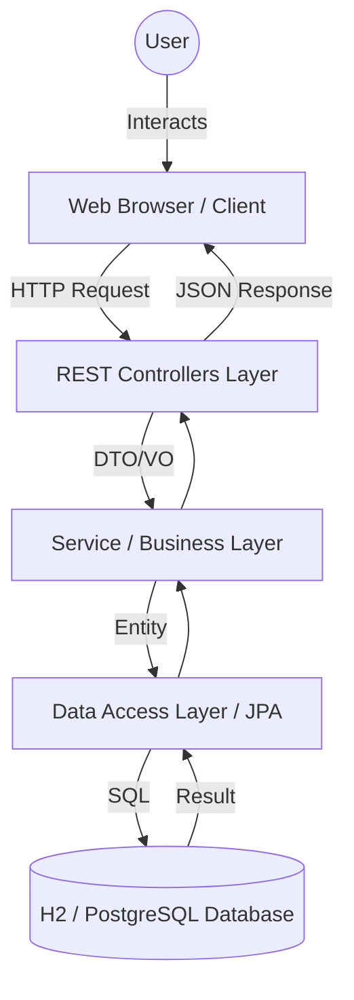

<<<<<<< HEAD
# 👔 Gestión de Contactos Empresariales

<div align="center">
  
  
  <br><br>

  [](https://www.oracle.com/java/)
  [](https://spring.io/projects/spring-boot)
  [](https://hibernate.org/)
  [](https://maven.apache.org/)
  [](https://h2database.com/)
  [](https://developer.mozilla.org/)

  <p align="center">
    <strong>Professional CRUD Application for Enterprise Contact Management</strong>
    <br />
    <a href="#-architecture">Architecture</a>
    ·
    <a href="#-technologies">Technologies</a>
    ·
    <a href="#-getting-started">Getting Started</a>
    ·
    <a href="#-api-documentation">API</a>
  </p>
</div>

---

## 📖 Overview

**Contactos Empresariales** is a robust, full-stack web application designed for the efficient management of corporate contact information. It facilitates a seamless experience for creating, reading, updating, and deleting (CRUD) professional profiles within an organization.

Built with performance and scalability in mind, the application leverages the **Spring Boot** ecosystem for the backend and strictly **Native Web Technologies** (Vanilla JS, CSS3) for the frontend, ensuring zero-dependency client-side performance and a lightweight footprint.

## 🏗 Architecture

The project follows a rigorous **Layered Architecture (MVC - Service Layer)** to ensure separation of concerns, testability, and maintainability.



### Key Components:
- **Presentation Layer (`src/main/resources/static`)**: 
  - Responsive UI built with Semantic HTML5 and Modern CSS3 (CSS Variables, Flexbox, Grid).
  - Dynamic interactions handled by vanilla JavaScript (ES6+) utilizing the Fetch API for asynchronous communication.
- **Controller Layer (`pe.edu.sencico.contacto.controller`)**: 
  - Exposes RESTful endpoints (`/contactos/*`).
  - Handles HTTP requests and responses using `ResponseEntity`.
  - Implements input validation (`@Valid`).
- **Service Layer (`pe.edu.sencico.contacto.service`)**: 
  - Encapsulates business logic.
  - Handles DTO-to-Entity conversion using the Converter pattern.
  - Manages transaction boundaries (`@Transactional`).
- **Persistence Layer (`pe.edu.sencico.contacto.repository`)**: 
  - Leverages Spring Data JPA for database abstraction.
  - Defines the data contract via the `ContactoRepository` interface.

## 🛠 Technologies

### Backend Stack
| Technology | Version | Purpose |
|------------|---------|---------|
| **Java** | 11/17 | Core programming language. |
| **Spring Boot** | 2.7.18 | Rapid application development framework. |
| **Spring Data JPA** | - | Abstraction over JPA for database interactions. |
| **Hibernate** | 5.x | ORM implementation. |
| **H2 Database** | In-Memory | Lightweight database for dev/testing environments. |
| **Lombok** | - | Boilerplate code reduction (Getters, Setters, etc.). |
| **Maven** | - | Dependency management and build automation. |

### Frontend Stack
| Technology | Description |
|------------|-------------|
| **HTML5** | Semantic structure. |
| **CSS3** | Modern "Light & Varied" design system, responsive layout. |
| **JavaScript** | Native ES6+ for DOM manipulation and API integration. |
| **Google Fonts** | 'Inter' font family for professional typography. |
| **FontAwesome** | Vector icons for UI elements. |

## 🚀 Getting Started

### Prerequisites
- JDK 11 or higher
- Maven 3.x
- Git

### Installation

1. **Clone the repository**
   ```bash
   git clone https://github.com/yourusername/contactos-empresariales.git
   cd contactos-empresariales
   ```

2. **Configuration**
   The application is pre-configured to use an **H2 In-Memory Database** for immediate execution. No external database setup is required correctly.
   
   *Check `src/main/resources/application.properties` to switch to PostgreSQL if needed.*

3. **Build and Run**
   ```bash
   ./mvnw spring-boot:run
   ```

4. **Access the Application**
   Open your browser and navigate to:
   ```
   http://localhost:9999
   ```

## 📡 API Documentation

The backend exposes a comprehensive REST API:

| Method | Endpoint | Description |
| :--- | :--- | :--- |
| `GET` | `/contactos/getAll` | Retrieve all registered contacts. |
| `GET` | `/contactos/getId/{id}` | Retrieve specific contact details. |
| `POST` | `/contactos/save` | Create a new contact. |
| `PUT` | `/contactos/getId/{id}` | Update an existing contact. |
| `DELETE` | `/contactos/delete/{id}` | Remove a contact. |

---

<div align="center">
  <p>Developed with ❤️ using Spring Boot</p>
  <sub>© 2025 | Contact Management Project | All Rights Reserved</sub>
</div>
=======
# JAVA-SPRING
Estoy aprendiendo a usar Spring Boot de manera mas profesional
>>>>>>> d4bf03ab79d0bcc4923e7966d738be75e4d89301
